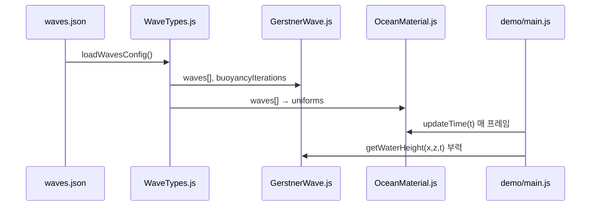

# 아키텍처

## 목표

Three.js WebGL 데모로 Gerstner 파도를 검증하고, **`core/` 모듈만 분리해 Cesium.js에 이식**한다.

## 레이어 구조

```
┌─────────────────────────────────────────────────────────┐
│  demo/          Three.js PoC (교체·삭제 가능)            │
├─────────────────────────────────────────────────────────┤
│  adapters/      엔진별 glue code                         │
│    three/       ShaderMaterial, PlaneGeometry            │
│    cesium/      Primitive, CustomShader (Phase 2)        │
├─────────────────────────────────────────────────────────┤
│  core/          ★ 엔진 무관 — Three.js/Cesium import 금지 │
│    math/        CPU Gerstner 솔버                        │
│    shaders/     GLSL (CPU와 동일 수식)                   │
│    types/       설정 파싱, 타입                          │
├─────────────────────────────────────────────────────────┤
│  configs/       waves.json (데이터)                      │
└─────────────────────────────────────────────────────────┘
```

## 설계 원칙

### 1. Core First

`core/`는 순수 JavaScript + GLSL만 사용한다. Three.js, Cesium, DOM API를 import하지 않는다.

Cesium 프로젝트에 `core/` 폴더만 복사해도 CPU 수면 높이 계산이 동작해야 한다.

### 2. Adapter Pattern

| 레이어 | 책임 |
|--------|------|
| `core` | 수학, 셰이더 소스, 설정 파싱 |
| `adapters/three` | `ShaderMaterial` 생성, uniform 패킹, `PlaneGeometry` |
| `adapters/cesium` | `Primitive`, ECEF 좌표 변환, CustomShader |
| `demo` | 씬 구성, 카메라, 조명, 샘플 오브젝트 |

### 3. CPU / GPU 수식 동기화

동일 Gerstner 수식을 두 곳에 유지한다.

| 위치 | 용도 |
|------|------|
| `core/math/GerstnerWave.js` | 부력, 피킹, Entity 고도 (CPU) |
| `core/shaders/gerstner.glsl` | 메시 변위, 법선 (GPU) |

수식 (파도 i):

```
φ = k · (D · P) + ω · t
P'.x += Q · A · D.x · cos(φ)
P'.z += Q · A · D.z · cos(φ)
P'.y += A · sin(φ)

k = 2π / L        (파수)
ω = speed · k     (각주파수)
```

### 4. 설정 단일 출처

모든 파도 파라미터는 `configs/waves.json`에서 로드한다.

* CPU: `loadWavesConfig()` → `GerstnerWave` 생성자
* GPU: `createOceanMaterial(waves)` → shader uniform

## 데이터 흐름



## Three.js 렌더링 파이프라인

1. `OceanMesh` — `PlaneGeometry` (xz 평면, Y-up)
2. `OceanMaterial` — `ocean.vert.glsl`에서 버텍스 변위 (GPU)
3. `ocean.frag.glsl` — 프레넬 기반 수면 색
4. `FloatingObject` — CPU `getWaterHeight()`로 오브젝트 y 보정

> GPU 변위와 CPU `getWaterHeight()`는 동일 수식이므로 시각·물리가 일치한다.

## Cesium 이식 시 변경점

| 항목 | Three.js (현재) | Cesium (Phase 2) |
|------|-----------------|------------------|
| 좌표계 | Y-up, 로컬 xz | WGS84 / ECEF → tangent plane |
| 메시 | `PlaneGeometry` | `GroundPrimitive` / Custom Geometry |
| 셰이더 | `ShaderMaterial` | `CustomShader` / Fabric |
| 시간 | `Clock.getElapsedTime()` | `viewer.clock.currentTime` 또는 elapsed |
| 카메라 uniform | `camera.position` | `viewer.camera.positionWC` |

`core/`는 변경 없이 유지. `adapters/cesium/`에서만 Cesium API를 사용한다.

## 파일 의존성 규칙

```
demo/           → adapters/three/, core/
adapters/three/ → core/shaders/, core/types/
adapters/cesium/→ core/ (Phase 2)
core/           → (외부 의존성 없음)
```

## 확장 포인트

| 기능 | 추가 위치 |
|------|-----------|
| 새 파도 타입 | `core/math/`, `core/shaders/gerstner.glsl` |
| 거품·하이라이트 | `core/shaders/ocean.frag.glsl` |
| FFT 오션 | `core/` 확장 + adapter uniform 추가 |
| Cesium 타일링 | `adapters/cesium/` |
