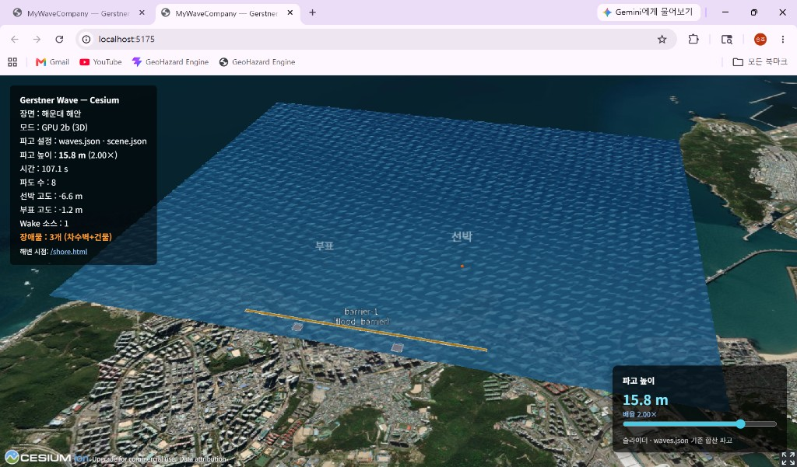
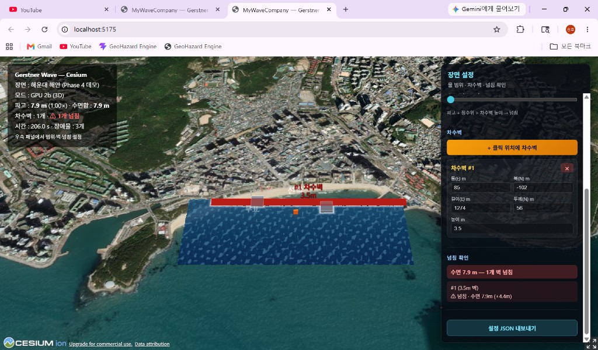
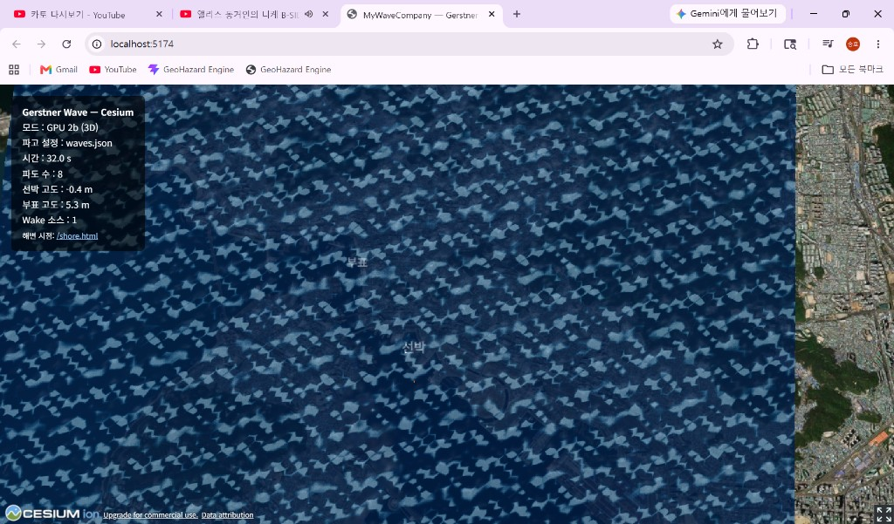

# MyAutomationEngine

**Cesium 위 해운대 해안에서 Gerstner 파도·2D 홍수·차수벽을 실시간으로 시뮬레이션하는 WebGL 프로젝트**

.NET CLI로 WebGL 스캐폴드를 생성하고, `MyWaveCompany_Generated/` 에서 **Cesium + Three.js** 데모를 실행합니다.

---

## 스크린샷

### Cesium 메인 — Gerstner GPU 3D 수면 + 차수벽



*위성 지도 위 GPU 3D 파고, 차수벽·건물 장애물, 파고/장애물 오버레이*

### 장면 설정 패널 — 클릭 배치 · 넘침 확인



*물 범위·파고·정수위 슬라이더, 클릭으로 차수벽 배치, 벽별 넘침(⚠) 판정*

### Phase 5 — 2D Shallow Water 홍수



*바다 쪽 유입 → 건물 우회 → 차수벽 차단 (CPU 2D 격자 + GPU 합성)*

---

## 주요 기능

| 기능 | 설명 |
|------|------|
| **Gerstner GPU 3D** | ENU 격자 + 버텍스 셰이더 실제 파고 변위 (`GerstnerWaterPrimitiveGPU`) |
| **해안 정렬** | `scene.json` — 해운대 앵커, offshore/landward 수면 범위 |
| **차수벽·건물** | `obstacles.json` + 클릭 배치, AABB dry 마스크, 양끝 넘침 foam |
| **장면 에디터** | 물 범위·파고·정수위·차수벽 #번호별 크기/위치/높이, JSON 내보내기 |
| **2D 홍수 (Phase 5)** | Shallow Water 격자, 유입·재생, Gerstner와 높이 합성 |
| **Three.js PoC** | `/shore.html` — 로컬 xz 데모 |

---

## 빠른 시작

### 요구 사항

- [.NET 10 SDK](https://dotnet.microsoft.com/download)
- [Node.js 20+](https://nodejs.org/) (Vite dev server)
- (선택) [Cesium ion](https://ion.cesium.com/) 토큰 — `.env` 에 `VITE_CESIUM_ION_TOKEN`

### 실행

```bash
git clone <repository-url>
cd MyAutomationEngine

# WebGL 프로젝트 스캐폴드 생성 (최초 1회)
dotnet run

# 개발 서버 (npm install 자동)
dotnet run -- serve
```

터미널에 표시된 **Local URL** 을 브라우저에서 엽니다 (예: `http://localhost:5173/`).

| URL | 내용 |
|-----|------|
| `/` | Cesium 메인 — Gerstner + 차수벽 + 홍수 |
| `/shore.html` | Three.js 해변 데모 |
| `/?material=1` | Material 2a 평면 모드 (GPU 디버그) |
| `/?debugObstacles=1` | 장애물 dry/wet 색상 오버레이 |

### 수동 실행 (npm만)

```bash
cd MyWaveCompany_Generated
npm install
npm run dev
```

---

## 기술 스택

| 영역 | 기술 |
|------|------|
| 스캐폴드 | .NET 10, `Program.cs` |
| 3D 지구 | [CesiumJS](https://cesium.com/) 1.122 |
| 로컬 3D | [Three.js](https://threejs.org/) 0.169 |
| 빌드 | Vite 5 |
| 파도 | Gerstner (GPU Gems Ch.1) — CPU + GLSL |
| 홍수 | 2D Diffusive-Advective Shallow Water (CPU) → GPU texture |
| 설정 | JSON (`Configs/*.json`) |

---

## 프로젝트 구조

```
MyAutomationEngine/
├── Program.cs                 # 기획서 → MyWaveCompany_Generated/ 생성
├── 기획서.md                  # 제품 목표 · North Star
├── docs/                      # 로드맵 · 기획 · 스크린샷
│   └── screenshots/           # README용 캡처
└── MyWaveCompany_Generated/
    ├── Configs/               # waves, scene, obstacles, flood …
    ├── core/                  # GerstnerWave, ShallowWater, ObstacleField …
    ├── adapters/
    │   ├── cesium/            # GPU 수면, FloodLayer, SceneEditor …
    │   └── three/             # OceanMaterial, OceanMesh
    ├── src/adapters/cesium/   # ★ Cesium 진입점 (cesium-main.js)
    └── index.html             # 메인 UI
```

**Cesium 진입점:** `MyWaveCompany_Generated/src/adapters/cesium/cesium-main.js`  
(`adapters/cesium/cesium-main.js` 는 레거시)

---

## 설정 파일

| 파일 | 역할 |
|------|------|
| `Configs/waves.json` | Gerstner 8파도 — 진폭·파장·방향 |
| `Configs/scene.json` | 해운대 앵커, 수면 범위, 카메라 |
| `Configs/obstacles.json` | 차수벽·건물 footprint |
| `Configs/flood.json` | 2D 홍수 격자·유입·속도 |
| `Configs/interaction.json` | Wake, collision |

우측 **「장면 설정」** 패널에서 런타임 조정 후 **설정 JSON 내보내기** 가능.  
상세: [docs/SCENE_LAYOUT.md](./docs/SCENE_LAYOUT.md)

---

## 아키텍처 (요약)

```
Layer 3  GPU 시각     — 거품, edge foam, 넘침 색
Layer 2  CPU 2D 홍수  — ShallowWater h,u,v + FloodLayer
Layer 1  Gerstner     — swell + chop (GPU 버텍스)
Layer 0  Cesium       — 위성·지형·Entity 장애물
```

---

## 문서

| 문서 | 설명 |
|------|------|
| [기획서.md](./기획서.md) | 제품 목표, 성공 기준 |
| [docs/ROADMAP.md](./docs/ROADMAP.md) | Phase별 로드맵 |
| [docs/DOC_GUIDE.md](./docs/DOC_GUIDE.md) | 구현 시 읽는 순서 |
| [진행상태.md](./진행상태.md) | 완료/미완 스냅샷 |
| [docs/SCENE_LAYOUT.md](./docs/SCENE_LAYOUT.md) | 물·차수벽 배치 |
| [docs/REFERENCE_VIDEO.md](./docs/REFERENCE_VIDEO.md) | 참조 영상 타겟 UX |
| [MyWaveCompany_Generated/docs/](./MyWaveCompany_Generated/docs/) | API, CONFIG, SHADER |

---

## 개발 상태 (2026-05)

| Phase | 내용 | 상태 |
|-------|------|------|
| 1~2c | Gerstner + Cesium GPU 3D | ✅ |
| 4 | 차수벽·건물 마스크 + SceneEditor | ✅ |
| 5 | 2D Shallow Water + FloodLayer | ✅ |
| 6 | 3D Tiles·지형 침수 | 📋 |
| 7 | Wake GPU, 연출 | 📋 |

---

## 스크린샷 갱신

데모 실행 후 Playwright로 캡처:

```bash
cd MyWaveCompany_Generated
npm run dev
# 다른 터미널:
node scripts/smoke-test.mjs http://localhost:5173/
```

수동 캡처는 `docs/screenshots/` 에 저장 후 README 경로를 맞춥니다.

---

## 참고

- [Cesium Gerstner GPU PoC](./MyWaveCompany_Generated/adapters/cesium/INTEGRATION.md)
- [GPU Gems Ch.1 — Water Simulation](https://developer.nvidia.com/gpugems/gpugems/part-i-natural-effects/chapter-1-effective-water-simulation-physical-models)

---

*MyAutomationEngine — 해안 도시 홍수·파도 WebGL 시뮬레이션*
