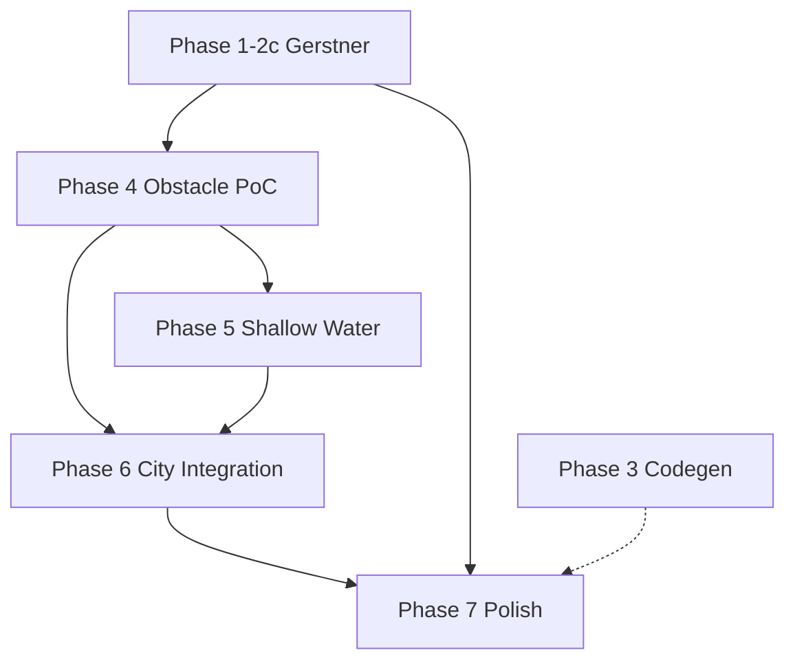

# 로드맵 — Phase별 목표·작업·참조 문서

> **기획 근거:** [기획서.md](../기획서.md)  
> **문서 네비게이션:** [DOC_GUIDE.md](./DOC_GUIDE.md)  
> **진행 스냅샷:** [진행상태.md](../진행상태.md)

---

## Phase 개요

```
Phase 1~2c  ✅ Gerstner 바다 + Cesium + Wake(CPU)     [완료]
Phase 4     📋 장애물·차수벽 PoC (물 막힘)              [다음]
Phase 5     📋 2D Shallow Water (물 갈라짐)            [예정]
Phase 6     📋 Cesium 도시·해안선 연동                 [예정]
Phase 7     📋 Wake GPU, 물리 polish, 성능             [예정]
Phase 3     📋 dotnet 코드 생성기                      [후순위]
```

---

## Phase 1~2c — Gerstner 바다 (✅ 완료)

### 목표
Three.js로 Gerstner 검증 → `core/` 분리 → Cesium GPU 3D 수면.

### 참조 문서
| 문서 | 내용 |
|------|------|
| [ARCHITECTURE.md](../frontend/docs/ARCHITECTURE.md) | 레이어 구조 |
| [INTEGRATION.md](../frontend/adapters/cesium/INTEGRATION.md) | Cesium 이식 |
| [API.md](../frontend/docs/API.md) | GerstnerWave API |
| [SHADER.md](../frontend/docs/SHADER.md) | GLSL 규칙 |

### 핵심 산출물
- `core/math/GerstnerWave.js`
- `adapters/cesium/GerstnerWaterPrimitiveGPU.js`
- `adapters/cesium/FloatingEntity.js`
- `core/math/WakeField.js`, `adapters/cesium/WakeRegistry.js`

### 세션 이후 추가 (문서화만, `진행상태.md` 보조)
- `Configs/scene.json` — 해안 정렬 (해운대)
- 파고 슬라이더 UI — `index.html`, `cesium-main.js`
- 8파도 + phase + chop — `waves.json`, 셰이더

---

## Phase 4 — 장애물 + 차수벽 PoC (📋 다음)

### 목표
**건물/차수벽 앞에서 물이 들어가지 않고**, 가장자리에서 **막히는 느낌** (dry zone + edge FX).

### 성공 기준 (DoD)
- [ ] `Configs/obstacles.json` 스키마 확정 및 샘플 1장면
- [ ] Cesium에 차수벽·박스 건물 시각화
- [ ] GPU: 장애물 내부/뒤 **수면 clip 또는 height=0**
- [ ] GPU: 장애물 **앞 edge foam / splash** (fragment)
- [ ] CPU: `getWaterHeight` 장애물 영역 dry
- [ ] 데모: 차수벽 **앞만** 물, **뒤는 dry**

### 작업 목록 (구현팀)

| # | 작업 | 참고 코드/문서 |
|---|------|----------------|
| 4-1 | `obstacles.json` 스키마 설계 | [CONFIG.md](../frontend/docs/CONFIG.md)에 추가 |
| 4-2 | `ObstacleBody` / `loadObstaclesConfig()` | `InteractionTypes.js` `CollisionBody` 패턴 |
| 4-3 | `ObstacleField.js` (core) — point-in-polygon, SDF | `core/` import 금지 준수 |
| 4-4 | GPU fragment 마스크 | `GerstnerWaterPrimitiveGPU.js` `buildFragmentShader`, `v_st`/world pos |
| 4-5 | Cesium Entity로 차수벽·건물 박스 | `FloatingEntity.js` Entity 패턴 |
| 4-6 | `cesium-main.js` obstacles 로드 | `scene.json` 연동 방식 결정 |
| 4-7 | 문서: [FLOOD.md §1](../frontend/docs/FLOOD.md) 마스크 PoC | ✅ 스펙 초안 |
| 4-8 | 문서: [SCENE_LAYOUT.md](./SCENE_LAYOUT.md) 물 범위·차수벽 JSON 편집 | ✅ 기획 |

### 참조 문서 (필독)
1. [기획서.md § North Star](../기획서.md)
2. [DOC_GUIDE.md § Phase 4+](./DOC_GUIDE.md)
3. [INTEGRATION.md](../frontend/adapters/cesium/INTEGRATION.md) — ENU 좌표
4. [SCENE_LAYOUT.md](./SCENE_LAYOUT.md) — 물 범위·차수벽 footprint
5. `core/types/SceneTypes.js` — 해안 `bearingToEnu`, footprint 좌표 변환

### 권장 1차 데모 장면
- **단순 직사각형 수면** + **박스 2~3개** + **차수벽 1개** (해운대 실경은 Phase 6)

---

## Phase 5 — 2D Shallow Water (📋 예정)

### 목표
물이 **유입 방향**으로 밀려와 건물 **사이로 갈라지고**, 차수벽에서 **흐름이 차단**됨.

### 성공 기준 (DoD)
- [ ] `Configs/flood.json` — 유입 방향, 유량, 격자 크기
- [ ] `core/math/ShallowWater.js` — h, u, v 시간 적분
- [ ] 장애물 = **no-flow** 경계
- [ ] GPU 버텍스: `height = gerstner + flood.h`
- [ ] 시각적으로 **분기·정체** 확인 가능

### 작업 목록

| # | 작업 | 참고 |
|---|------|------|
| 5-1 | SWE 명세 | `docs/FLOOD.md` §2 |
| 5-2 | CPU tick + obstacle boundary | Phase 4 `ObstacleField` |
| 5-3 | Height field → GPU texture or uniform grid | `SHADER.md` 확장 |
| 5-4 | Gerstner와 합성 규칙 | `ARCHITECTURE.md` 데이터 흐름 |
| 5-5 | 유량·파고 슬라이더 연동 | 기존 `waveControls` 패턴 |

### 참조 문서
- [ARCHITECTURE.md § CPU/GPU 동기화](../frontend/docs/ARCHITECTURE.md)
- [API.md](../frontend/docs/API.md) — `getWaterHeight` 확장
- Phase 4 전체 산출물

---

## Phase 6 — Cesium 도시·해안선 (📋 예정)

### 목표
**해운대 등 실제 좌표**에서 위성·3D 건물과 **장애물·수면** 위치 일치.

### 성공 기준 (DoD)
- [ ] 해안선 **폴리곤 clip** (직사각형 탈피)
- [ ] 건물 footprint: GeoJSON 또는 3D Tiles (1안 선택)
- [ ] 차수벽 **polyline** 배치
- [ ] `scene.json` + `obstacles.json`로 장면 재현

### 작업 목록

| # | 작업 | 참고 |
|---|------|------|
| 6-1 | GeoJSON coastline | `SceneTypes.js`, `buildCoastalEnuGeometry` |
| 6-2 | Cesium 3D Tiles footprint 추출 (선택) | Cesium API |
| 6-3 | 수면 mesh triangulation inside polygon | GPU geometry builder |
| 6-4 | Phase 5 flood + 실경 장애물 | 통합 테스트 |

### 참조 문서
- `Configs/scene.json` (현재 해운대)
- [INTEGRATION.md § 좌표계](../frontend/adapters/cesium/INTEGRATION.md)

---

## Phase 7 — Polish (📋 예정)

| 항목 | 참고 |
|------|------|
| Wake GPU 표시 | `wake.glsl`, `GerstnerWaterPrimitiveGPU.js` (uniform 제거 이력 주의) |
| FloatingEntity 질량·항력 | `interaction.json` `dragCoefficient` |
| HeightFieldCache | `진행상태.md` Phase 2c-4 |
| Overflow (넘치는 차수벽) | `docs/FLOOD.md` §3 |
| TileManager | `진행상태.md` Phase 2c-6 |

---

## Phase 3 — dotnet 생성기 (📋 후순위)

### 목표
`dotnet run`으로 `Templates/` → `frontend/` 의미 있는 생성.

### 참조
- [진행상태.md § Phase 3](../진행상태.md)
- `Program.cs`, `Templates/`

**주의:** Phase 4~6 수동 구현과 충돌하지 않도록 생성 범위 분리.

---

## Phase ↔ 파일 (신규 예정)

| Phase | 신규 Config | 신규 core | 신규 adapters/cesium | 신규 docs |
|-------|-------------|-----------|----------------------|-----------|
| 4 | `obstacles.json` | `ObstacleField.js` | `ObstacleRegistry.js`, barrier Entity | `FLOOD.md` §1 |
| 5 | `flood.json` | `ShallowWater.js` | flood uniform/texture | `FLOOD.md` §2 |
| 6 | GeoJSON refs | — | coastline clip | `FLOOD.md` §3 |

---

## 의존성 그래프



---

*Phase 4 착수 시 이 문서의 DoD 체크박스와 [진행상태.md](../진행상태.md)를 함께 갱신한다.*
