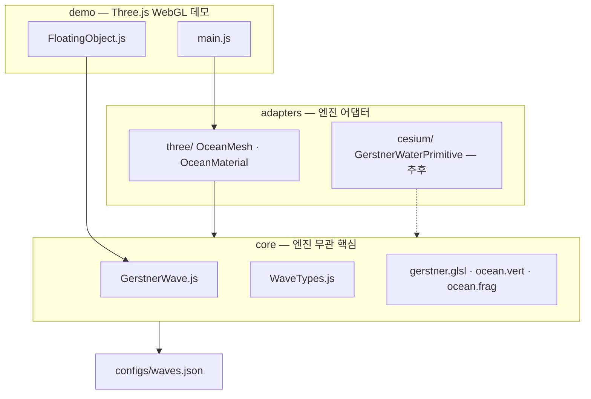

# MyWaveCompany — 기획서

> `Program.cs`가 이 문서를 읽어 `./MyWaveCompany_Generated/` 아래에 파일·폴더를 생성합니다.

## 실행 방법

프로젝트 루트에서:

```bash
dotnet run
```

성공 시 콘솔에 `[공장] 파일 생성: ...` 또는 `[공장] 폴더 생성: ...` 메시지가 출력됩니다.

---

## Program.cs 파싱 규칙

| 규칙 | 설명 |
|------|------|
| 대상 줄 | **`- `**(하이픈 + 공백)으로 시작하는 줄만 처리 |
| 파일 | 경로에 **`.`** 이 포함되면 파일 → `// TODO: 자동 생성된 코드 파일입니다.` 내용으로 생성 |
| 폴더 | **`.`** 이 없으면 폴더만 생성 |
| 출력 루트 | `./MyWaveCompany_Generated/` |
| 무시 | `- `로 시작하지 않는 줄(제목, 표, 설명, 백로그 등)은 모두 무시 |

> **주의:** `- [ ]` 형태도 `- `로 시작하므로 생성 대상으로 잘못 인식됩니다.  
> 백로그·참고 자료에는 `- ` 접두사를 쓰지 마세요.

### 파일·폴더 접두사 (`.cursorrules` §5)

| 접두사 | 의미 | 규칙 |
|--------|------|------|
| `gen_` | 자동화 엔진 생성 | 직접 수정 금지 → 기획서/템플릿 수정 |
| `src_` | 사람이 작성한 소스 | 자유롭게 수정 가능 |
| `lib_` | 외부 라이브러리 의존 | `core/`에는 **절대 금지** |

---

## 프로젝트 개요

### 목표

**Gerstner Wave 기반 WebGL 오션**을 Three.js로 먼저 구현하고,  
엔진에 종속되지 않는 **`core` 모듈**을 분리해 이후 **Cesium.js** 프로젝트에 그대로 이식할 수 있게 만든다.

### 설계 원칙

| 원칙 | 설명 |
|------|------|
| **Core First** | `core/`는 Three.js·Cesium import 금지. 순수 JS + GLSL만 사용 |
| **Adapter Pattern** | 렌더링 엔진별 코드는 `adapters/three`, `adapters/cesium`에만 둠 |
| **Shader 공유** | CPU(`GerstnerWave.js`)와 GPU(`gerstner.glsl`) 수식을 동일하게 유지 |
| **설정 분리** | 파도 파라미터는 `configs/waves.json` 한 곳에서 관리 |
| **공개 API** | `getWaterHeight(x, z, time)` — Cesium 엔티티·카메라·피킹에 재사용 |

### 아키텍처



### Cesium.js 이식 경로 (Phase 2 이후)

1. `core/` 폴더를 Cesium 프로젝트에 **복사** (또는 npm 패키지화)
2. `adapters/cesium/GerstnerWaterPrimitive.js`에서 Cesium `Primitive` / `CustomShader` 연결
3. `GerstnerWave.getWaterHeight()`로 선박·부표·카메라 고도 보정
4. Three.js 데모(`demo/`)는 제거해도 `core` + `adapters/cesium`만으로 동작

---

## 폴더 구조

```
MyWaveCompany_Generated/
├── index.html              # WebGL 데모 진입점
├── package.json            # three, vite 의존성
├── vite.config.js          # 개발 서버 + GLSL import
├── README.md
│
├── configs/                # 데이터 (엔진 무관)
│   └── waves.json
│
├── core/                   # ★ Cesium 이식 핵심 — 외부 라이브러리 import 금지
│   ├── index.js            # 공개 API re-export
│   ├── types/
│   │   └── WaveTypes.js    # GerstnerWave 타입·기본값
│   ├── math/
│   │   └── GerstnerWave.js # CPU: 변위·법선·getWaterHeight
│   └── shaders/
│       ├── gerstner.glsl   # 공통 Gerstner 함수 (include)
│       ├── ocean.vert.glsl # 버텍스 셰이더
│       └── ocean.frag.glsl # 프래그먼트 셰이더 (수면 색·프레넬)
│
├── adapters/               # 렌더링 엔진별 glue code
│   ├── three/
│   │   ├── index.js
│   │   ├── OceanMaterial.js  # ShaderMaterial + uniform 바인딩
│   │   └── OceanMesh.js      # PlaneGeometry + 매 프레임 업데이트
│   └── cesium/
│       ├── index.js
│       ├── GerstnerWaterPrimitive.js  # Cesium Primitive 스텁
│       └── INTEGRATION.md             # Cesium 연동 가이드 (추후 작성)
│
├── demo/                   # Three.js WebGL PoC (Cesium 프로젝트에 불필요)
│   ├── main.js             # Scene · Camera · Renderer · OceanMesh
│   └── FloatingObject.js   # getWaterHeight 부력 샘플
│
└── public/                 # 정적 에셋 (스카이박스, 노멀맵 등 — 선택)
```

---

## 파일 역할 정의

| 파일 | 레이어 | 역할 |
|------|--------|------|
| `configs/waves.json` | config | 파도 배열·메시 해상도·시간 스케일 |
| `core/types/WaveTypes.js` | core | `GerstnerWave` 구조체, JSON 파싱, 기본값 |
| `core/math/GerstnerWave.js` | core | `displacement()`, `normal()`, `getWaterHeight()` |
| `core/shaders/gerstner.glsl` | core | GPU Gerstner 수식 (vert/frag에서 `#include`) |
| `core/shaders/ocean.vert.glsl` | core | 메시 변위 + 법선 계산 |
| `core/shaders/ocean.frag.glsl` | core | 수면 색상, 하늘 반사, 깊이 페이드 |
| `core/index.js` | core | 외부 공개 API (`export { GerstnerWave, loadWaves }`) |
| `adapters/three/OceanMaterial.js` | adapter | Three.js `ShaderMaterial` 생성·uniform 갱신 |
| `adapters/three/OceanMesh.js` | adapter | `THREE.Mesh` + `requestAnimationFrame` 루프 |
| `adapters/cesium/GerstnerWaterPrimitive.js` | adapter | Cesium `Primitive` / `Material` 스텁 |
| `adapters/cesium/INTEGRATION.md` | adapter | Cesium CustomShader 이식 체크리스트 |
| `demo/main.js` | demo | Three.js WebGL 데모 씬 |
| `demo/FloatingObject.js` | demo | CPU `getWaterHeight` 부력 예제 |
| `index.html` | demo | `<canvas>` + `demo/main.js` 로드 |
| `package.json` | root | `three`, `vite`, `vite-plugin-glsl` |
| `vite.config.js` | root | GLSL import, dev server 설정 |

---

## 생성 대상

아래 목록만 `- ` 형식을 사용합니다. 경로를 추가·삭제하면 `dotnet run` 결과가 바뀝니다.

### 폴더

- configs
- core
- core/types
- core/math
- core/shaders
- adapters
- adapters/three
- adapters/cesium
- demo
- public

### 파일 — 루트

- package.json
- vite.config.js
- index.html
- README.md

### 파일 — 설정

- configs/waves.json

### 파일 — core (Cesium 이식 핵심)

- core/index.js
- core/types/WaveTypes.js
- core/math/GerstnerWave.js
- core/shaders/gerstner.glsl
- core/shaders/ocean.vert.glsl
- core/shaders/ocean.frag.glsl

### 파일 — adapters/three

- adapters/three/index.js
- adapters/three/OceanMaterial.js
- adapters/three/OceanMesh.js

### 파일 — adapters/cesium

- adapters/cesium/index.js
- adapters/cesium/GerstnerWaterPrimitive.js
- adapters/cesium/INTEGRATION.md

### 파일 — demo

- demo/main.js
- demo/FloatingObject.js

---

## 파도 기본 설정 (참고)

`configs/waves.json` 초기값:

| 이름 | 방향 (x, z) | 진폭 | 파장 | 속도 | 첨예도 |
|------|-------------|------|------|------|--------|
| Main Swell | (1.0, 0.5) | 0.8 | 80 | 8 | 0.5 |
| Cross Swell | (0.3, 1.0) | 0.4 | 40 | 5 | 0.4 |
| Ripple | (-0.5, 0.8) | 0.15 | 15 | 3 | 0.3 |

---

---

## AI 협업 — 필독 문서 (Claude.ai / Cursor 공통)

새 세션·다른 AI 도구에서 작업을 이어갈 때 **아래 순서대로** 읽는다.

### 1순위 — 반드시 먼저

| 순서 | 문서 | 왜 읽는가 |
|------|------|-----------|
| 0 | **`.cursorrules`** | Cursor AI 프로젝트 규칙 (아키텍처, 코드 스타일, 제약) |
| 1 | **이 파일** `기획서.md` | 목표, 폴더 구조, 생성 규칙, 다음 작업 |
| 2 | [진행상태.md](./진행상태.md) | Phase 1·1.5 완료 현황, 미착수 항목 |
| 3 | [MyWaveCompany_Generated/docs/ARCHITECTURE.md](./MyWaveCompany_Generated/docs/ARCHITECTURE.md) | core / adapters / demo 레이어, 설계 원칙 |

### 2순위 — 구현 시 참고

| 문서 | 언제 읽는가 |
|------|-------------|
| [docs/API.md](./MyWaveCompany_Generated/docs/API.md) | `GerstnerWave`, `loadWavesConfig` 수정·사용 시 |
| [docs/CONFIG.md](./MyWaveCompany_Generated/docs/CONFIG.md) | `waves.json` 파라미터 변경 시 |
| [docs/SHADER.md](./MyWaveCompany_Generated/docs/SHADER.md) | GLSL / uniform 수정 시 |
| [core/README.md](./MyWaveCompany_Generated/core/README.md) | Cesium에 core만 복사할 때 |
| [adapters/three/README.md](./MyWaveCompany_Generated/adapters/three/README.md) | Three.js 데모 수정 시 |
| [adapters/cesium/INTEGRATION.md](./MyWaveCompany_Generated/adapters/cesium/INTEGRATION.md) | **Phase 2 Cesium 작업 시 필수** |

### 3순위 — 코드 직접 확인

| 파일 | 내용 |
|------|------|
| `MyWaveCompany_Generated/core/math/GerstnerWave.js` | CPU Gerstner (완료) |
| `MyWaveCompany_Generated/core/shaders/gerstner.glsl` | GPU Gerstner (완료) |
| `MyWaveCompany_Generated/adapters/three/OceanMaterial.js` | Three.js uniform 패킹 (완료) |
| `MyWaveCompany_Generated/adapters/cesium/TangentPlane.js` | ENU 좌표 변환 (완료) |
| `MyWaveCompany_Generated/adapters/cesium/GerstnerWaterPrimitive.js` | Cesium Primitive (Phase 2a 완료, 2b GPU 변위 예정) |
| `MyWaveCompany_Generated/adapters/cesium/FloatingEntity.js` | Entity 수면 추종 (완료) |
| `MyWaveCompany_Generated/adapters/cesium/cesium-main.js` | Cesium 데모 진입점 (완료) |
| `MyWaveCompany_Generated/cesium.html` | Cesium 데모 HTML (완료) |
| `MyWaveCompany_Generated/demo/main.js` | Three.js 데모 (완료) |
| `Program.cs` | `dotnet run` 스캐폴드 생성기 (기존 파일 보호) |

### 작업 시 주의

* **`.cursorrules`** — 자동화 엔진 구조·기획서 우선·성능 최우선·외부 API 최소화
* **접두사** — `gen_` 수정 금지, `src_` 수동 코드, `lib_`는 `core/` 금지
* `core/`에 Three.js·Cesium import **금지**
* `기획서.md` 백로그·참고에는 `- ` 접두사 **금지** (`Program.cs`가 파일로 인식함)
* `dotnet run` — 기획서 생성 대상 **신규 파일만** TODO 기록, **기존 파일은 건너뜀** (보호됨)

---

## Claude.ai 세션 완료 기록 (2026-05-25)

| 배치 | 내용 | 파일 수 |
|------|------|---------|
| Batch A | `core/` 전체 복원 | 7 |
| Batch B | `adapters/three/` 복원 | 3 |
| Batch C | `demo/` + 루트 복원 | 5 |
| Task 2-2 | `GerstnerWaterPrimitive.js` 재완성 | 1 |
| — | `cesium/index.js` + `INTEGRATION.md` 복원 | 2 |
| Task 2-4 | Cesium 단독 데모 신규 (`cesium.html`, `cesium-main.js`) | 2 |

**추가 완료 (동 세션):** Task 2-1 `TangentPlane.js`, Task 2-3 `FloatingEntity.js`

### Phase 2 실행 방법

```bash
cd MyWaveCompany_Generated
npm run dev
```

| URL | 내용 |
|-----|------|
| http://localhost:5173/ | Three.js 데모 (`index.html`) |
| http://localhost:5173/cesium.html | Cesium 데모 (Ion 토큰 필요) |

---

## 다음 작업 (즉시 착수 — Phase 2c)

> Phase 2b **완료**. Phase 2c Task 2c-1(Wake 데이터 파이프)부터 착수.

* [ ] Task 2c-1 — `interaction.json` + `InteractionTypes.js` + `WakeField.js`
* [ ] Task 2c-2 — `WakeRegistry.js` + `FloatingEntity` 속도 연동
* [ ] Task 2c-3 — `wake.glsl` + `GerstnerWaterPrimitiveGPU` uniform
* [ ] Task 2c-4 — `HeightFieldCache.js` (Entity CPU 최적화)
* [ ] Task 2c-5 — Collision draft/submerge
* [ ] Task 2c-6 — `TileManager.js` stub (다중 타일 PoC)

---

## 다음 작업 (이후 — Phase 3)

| Task | 내용 |
|------|------|
| 3-1 | `Program.cs` — `.js`/`.glsl`/`.json` 확장자별 실제 템플릿 생성 |
| 3-2 | `waves.json` → 생성 코드에 파도 파라미터 주입 |
| 3-3 | 생성 후 필수 파일·API 존재 검증 스크립트 |

---

## 완료된 작업 (참고)

### Phase 1 — Core + Three.js WebGL 데모 ✅

* [x] core/math/GerstnerWave.js
* [x] core/shaders/
* [x] adapters/three/
* [x] demo/main.js, FloatingObject.js
* [x] vite dev server

### Phase 1.5 — 문서화 ✅

* [x] README, docs/ARCHITECTURE·API·CONFIG·SHADER
* [x] core/README, adapters/cesium/INTEGRATION.md

### Phase 2 — Cesium.js 이식 ✅ (Phase 2a)

* [x] Task 2-1 — `TangentPlane.js` (ENU 좌표 변환)
* [x] Task 2-2 — `GerstnerWaterPrimitive.js` (Material + uTime 애니메이션)
* [x] Task 2-3 — `FloatingEntity.js` (Entity 수면·기울기 추종)
* [x] Task 2-4 — `cesium.html` + `cesium-main.js` (Cesium 단독 데모)
* [x] Batch A/B/C — core, adapters/three, demo, 루트 복원

### Phase 2b — GPU 버텍스 변위 ✅

* [x] `GerstnerWaterPrimitiveGPU.js` — ENU tessellated Geometry + VS Gerstner 변위
* [x] `u_time` uniformMap 인터셉트 + Fresnel fragment shader
* [x] `cesium-main.js` Phase 2b 모드 전환
* [x] Cesium Ion 토큰 `import.meta.env.CESIUM_ION_TOKEN` 지원

---

## Phase 2c 기획 — 파도 상호작용 및 최적화 (PM 검토)

> **작성:** Senior PM · Phase 2c 착수 전 상태 점검  
> **전제:** Phase 2b `GerstnerWaterPrimitiveGPU` + `FloatingEntity` 구현 완료

### 현재 상태 요약

| 구성요소 | 파일 | 역할 | 결합 방향 |
|----------|------|------|-----------|
| GPU 수면 | `GerstnerWaterPrimitiveGPU.js` | ENU 격자 + VS Gerstner 변위 + FS Fresnel | — |
| CPU 솔버 | `core/math/GerstnerWave.js` | `getWaterHeight`, `normal`, `displacement` | GPU와 **동일 수식** (공유) |
| 좌표 브리지 | `TangentPlane.js` | WGS84 ↔ ENU ↔ Gerstner 로컬 | GPU `modelMatrix` + CPU 샘플링 |
| 부유체 | `FloatingEntity.js` | Entity position/orientation CallbackProperty | **수면 → 물체** (단방향) |

**현재 한계:** 물체가 파도에 반응하지만, **물체가 파도(Wake)에 영향을 주지 않음**. 충돌·반발 로직 없음.

---

### 아키텍처 — 데이터 흐름도 (현재)

```mermaid
flowchart TB
    subgraph config [configs/]
        WJ[waves.json]
    end

    subgraph core_layer [core/ — 엔진 무관]
        WT[WaveTypes.js<br/>loadWavesConfig]
        GW[GerstnerWave.js<br/>CPU 솔버]
        GLSL[gerstner.glsl]
    end

    subgraph cesium_demo [cesium-main.js]
        VIEWER[Cesium.Viewer<br/>clock · preRender]
    end

    subgraph gpu [GerstnerWaterPrimitiveGPU]
        BUILD[buildEnuGeometry<br/>N×N 격자]
        BVS[buildVertexShader<br/>파도 파라미터 인라인]
        PRIM[Cesium.Primitive<br/>modelMatrix = enuToEcef]
        PRE[preRender → u_time<br/>_commands uniformMap]
    end

    subgraph cpu_entity [FloatingEntity × N]
        CB_POS[CallbackProperty position]
        CB_ORI[CallbackProperty orientation]
    end

    subgraph bridge [TangentPlane]
        ENU[enuToEcef / ecefToEnu]
        GWA[getWaterAltitude]
        GWN[getWaveNormalEnu]
    end

    WJ --> WT --> GW
    WT --> BVS
    GLSL -.->|수식 참조| BVS

    VIEWER --> PRE
    PRE --> PRIM
    BUILD --> PRIM
    BVS --> PRIM
    ENU --> PRIM

    VIEWER --> CB_POS
    VIEWER --> CB_ORI
    CB_POS --> GWA
    CB_ORI --> GWN
    GWA --> GW
    GWN --> GW
    GWA --> ENU
    GWN --> ENU

    GW -.->|gerstnerSolver 공유| gpu
    bridge -.->|plane 공유| gpu
```



**데이터 흐름 요약**

1. **초기화:** `waves.json` → `loadWavesConfig` → `GerstnerWave` + VS에 파도 리터럴 bake
2. **GPU 루프:** `viewer.clock` → `preRender` → `u_time` → VS Gerstner 변위 → ECEF 렌더
3. **CPU 루프 (Entity당):** `CallbackProperty` → `(lon,lat)` → `TangentPlane` → `GerstnerWave.getWaterHeight/normal` → Entity transform
4. **공유 지점:** `ocean.gerstnerSolver` + `ocean.plane` — GPU·CPU 동기화의 유일한 링크

---

### 기술 부채 — 대규모 씬 병목 3가지

| # | 병목 | 현재 구현 | 대규모 씬 영향 | Phase 2c 대응 방향 |
|---|------|-----------|----------------|-------------------|
| **TD-1** | **Entity당 CPU Gerstner 풀샘플링** | `FloatingEntity` CallbackProperty가 Entity마다 `getWaterAltitude` + `getWaveNormalEnu` 매 프레임 실행 (파도 수 × buoyancyIterations) | Entity 100+ 시 CPU 병목, 프레임 드롭 | `HeightFieldCache` (타일 단위 고도 캐시) + Entity는 캐시 보간만 |
| **TD-2** | **단일 ENU 메시, 고정 해상도** | `GerstnerWaterPrimitiveGPU` — 1타일(~10 km), resolution 96²≈9K verts, 셰이더 bake 후 파라미터 변경 불가 | Globe·연안 대규모 커버 불가, 줌아웃 시 오버드로우 | **타일 LOD** (카메라 거리별 resolution) + `TileManager` |
| **TD-3** | **단방향 결합 + Wake 부재** | GPU VS = 순수 Gerstner, Entity 속도·형상이 수면에 전달되지 않음 | 선박·구조물 상호작용 불가, Wake 연출 0 | `WakeRegistry` + `u_wakeSources[]` uniform + `interaction.json` |

---

### Phase 2c — 목표 및 범위

**목표:** 파도 ↔ 물체 **양방향 상호작용**의 최소 viable product (MVP)

| 기능 | 설명 | 우선순위 |
|------|------|----------|
| **Wake (尾迹)** | 물체 속도·방향에 따른 국소 파도 disturbance | P0 |
| **Collision (부력/침수)** | hull vs `getWaterHeight` — draft·submerge 판정 | P1 |
| **최적화** | TD-1~3 완화 — 캐시·타일·Wake GPU | P0~P1 |

---

### Phase 2c — 데이터 구조 변경 제안

#### 1. `configs/interaction.json` (신규)

```json
{
  "wake": {
    "maxSources": 16,
    "defaultStrength": 0.4,
    "defaultRadiusM": 25,
    "decayTimeSec": 8,
    "minSpeedKnots": 1.0
  },
  "collision": {
    "buoyancyIterations": 3,
    "submergeThresholdM": 0.2,
    "dragCoefficient": 0.05
  },
  "performance": {
    "heightFieldCacheTileSizeM": 64,
    "heightFieldCacheRefreshHz": 10,
    "maxEntitiesPerFrame": 32
  }
}
```

#### 2. `core/types/InteractionTypes.js` (신규 — Cesium import 금지)

```typescript
// WakeSource — GPU/CPU 공통
{
  id: string,
  x: number, z: number,     // Gerstner 로컬 ENU (m)
  vx: number, vz: number,   // 속도 (m/s)
  strength: number,         // 0~1
  radiusM: number,
  ageSec: number
}

// CollisionBody — CPU only
{
  id: string,
  lon: number, lat: number,
  hullHalfWidthM: number,
  hullDraftM: number,
  massKg: number
}
```

#### 3. `core/math/WakeField.js` (신규)

* `computeWakeDisplacement(x, z, sources, time)` — Gerstner에 **가산**되는 국소 ripple
* `GerstnerWave`와 분리 유지 → `totalHeight = gerstner + wake`

#### 4. `core/shaders/wake.glsl` (신규)

* `wakeDisplacement(sources[MAX_WAKE], worldXZ, time)` — VS에서 Gerstner 뒤에 `#include`
* `GerstnerWaterPrimitiveGPU.buildVertexShader`에 wake 블록 optional merge

#### 5. `adapters/cesium/WakeRegistry.js` (신규)

* `FloatingEntity` velocity 추적 → `WakeSource[]` 갱신
* `GerstnerWaterPrimitiveGPU.updateWakeSources(sources)` — uniform 또는 셰이더 rebuild

#### 6. `FloatingEntity` 확장 (수정)

* `prevLon/prevLat` → 속도 계산 → `WakeRegistry.register(id, vel)`
* `getSubmergeRatio()` — collision P1

#### 7. `GerstnerWaterPrimitiveGPU` 확장 (수정)

* `u_wakeCount`, `u_wakePos[MAX]`, `u_wakeVel[MAX]`, `u_wakeStrength[MAX]` uniform
* TD-2 대비: `TileDescriptor` 인터페이스 stub (Phase 2c 후반)

---

### Templates/ 호환 구조 (자동화 엔진)

`Program.cs`는 `Templates/` → `MyWaveCompany_Generated/src/adapters/cesium/` 복제.  
Phase 2c부터 **접두사 규칙**과 함께 Templates를 아래처럼 정리:

```
Templates/
├── configs/
│   └── gen_interaction.json          # gen_ — waves.json과 함께 생성
├── core/
│   ├── gen_WakeField.js              # gen_ — core/math 스캐폴드
│   └── gen_wake.glsl                 # gen_ — core/shaders 스캐폴드
└── adapters/cesium/
    ├── gen_WakeRegistry.js             # gen_ — Registry 스텁
    └── src_FloatingEntity.patch.md     # src_ — 수동 merge 가이드 (FloatingEntity 확장)
```

| 접두사 | Templates 예 | 생성 후 위치 | 수정 |
|--------|----------------|--------------|------|
| `gen_` | `gen_WakeField.js` | `core/math/WakeField.js` | 기획서/템플릿만 |
| `gen_` | `gen_interaction.json` | `configs/interaction.json` | 기획서/템플릿만 |
| `src_` | `src_WakeRegistry.js` | `adapters/cesium/WakeRegistry.js` | 개발자 직접 |
| `lib_` | (없음) | `core/` **금지** | — |

> **Program.cs 개선 (Phase 3 연계):** 현재 `Templates/` → `src/adapters/cesium/` 고정 경로. Phase 3에서 `gen_`/`src_` 접두사별 대상 경로 매핑 테이블을 `기획서.md`에 명시.

---

### Phase 2c — Task 백로그

#### Task 2c-1 — Wake 데이터 파이프 (P0)

* **생성:** `configs/interaction.json`, `core/types/InteractionTypes.js`, `core/math/WakeField.js`
* **수정:** `core/index.js` export 추가
* **완료 기준:** CPU `WakeField + GerstnerWave` 합산 높이 단위 테스트

#### Task 2c-2 — WakeRegistry + FloatingEntity 연동 (P0)

* **생성:** `adapters/cesium/WakeRegistry.js`
* **수정:** `FloatingEntity.js` — 속도 추적 → Registry 등록
* **완료 기준:** 선박 이동 시 `WakeSource` 갱신, 정지 시 decay

#### Task 2c-3 — GPU Wake 셰이더 (P0)

* **생성:** `core/shaders/wake.glsl`
* **수정:** `GerstnerWaterPrimitiveGPU.js` — wake uniform + VS merge
* **완료 기준:** 선박 뒤 V자형 ripple 시각 확인

#### Task 2c-4 — HeightFieldCache (TD-1, P1)

* **생성:** `core/math/HeightFieldCache.js`
* **수정:** `FloatingEntity` — 캐시 보간 우선, miss 시 full sample
* **완료 기준:** Entity 50개 @ 30fps CPU 프로파일 개선

#### Task 2c-5 — Collision draft/submerge (TD-3, P1)

* **수정:** `FloatingEntity.getSubmergeRatio()`, `interaction.json` collision 섹션
* **완료 기준:** draft 초과 시 경고 UI / 색상 변화

#### Task 2c-6 — TileManager stub (TD-2, P2)

* **생성:** `adapters/cesium/TileManager.js` (인터페이스 + 단일 타일 wrapper)
* **완료 기준:** 다중 타일 API 설계 문서화, 2타일 PoC

---

### Phase 2c — 생성 대상 추가 (Program.cs용)

> `- ` 접두사 — `dotnet run` 시 신규 파일만 생성

#### 폴더

* (없음 — 기존 configs, core/math, core/shaders, adapters/cesium 재사용)

#### 파일 — 설정

* configs/interaction.json

#### 파일 — core

* core/types/InteractionTypes.js
* core/math/WakeField.js
* core/math/HeightFieldCache.js
* core/shaders/wake.glsl

#### 파일 — adapters/cesium

* adapters/cesium/WakeRegistry.js
* adapters/cesium/TileManager.js

---

### Phase 2c — AI 협업 3순위 코드 목록 갱신

| 파일 | 상태 |
|------|------|
| `GerstnerWaterPrimitiveGPU.js` | ✅ Phase 2b 완료 |
| `FloatingEntity.js` | ✅ Phase 2a — Phase 2c에서 Wake 연동 예정 |
| `WakeRegistry.js` | ❌ Phase 2c-2 |
| `core/math/WakeField.js` | ❌ Phase 2c-1 |
| `configs/interaction.json` | ❌ Phase 2c-1 |

---

## 다음 작업 (즉시 착수 — Phase 2c)

* [GPU Gems Ch.1 — Effective Water Simulation from Physical Models](https://developer.nvidia.com/gpugems/gpugems/part-i-natural-effects/chapter-1-effective-water-simulation-physical-models)
* [Three.js ShaderMaterial](https://threejs.org/docs/#api/en/materials/ShaderMaterial)
* [Cesium CustomShader](https://cesium.com/learn/cesiumjs/ref-doc/CustomShader.html)
* [진행상태.md](./진행상태.md) — 현재 진행 상태 및 목표 상세
